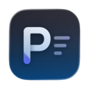
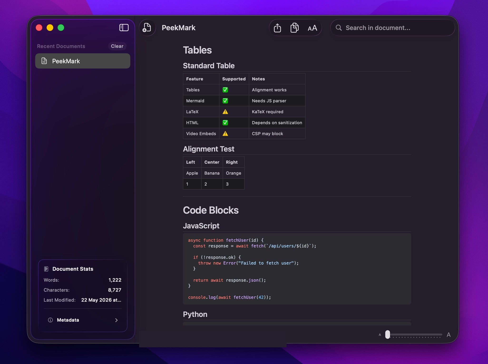
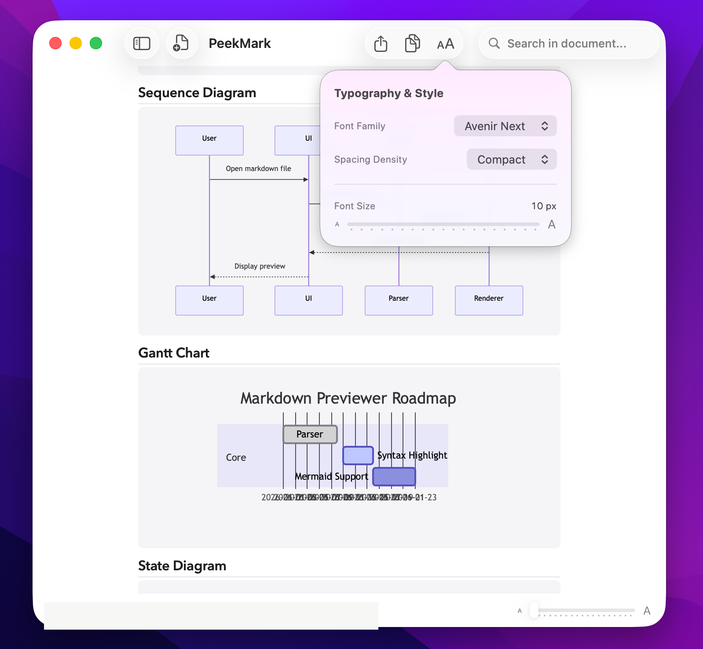
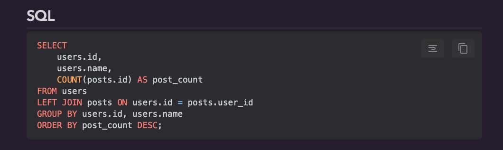

# PeekMark

<p align="center">
  
  <br>
  <b>A premium, native macOS Markdown reader and Finder Quick Look previewer.</b>
  <br><br>
  
  
  
</p>

PeekMark is a high-performance, native macOS utility that brings a premium document-reading experience to Markdown files. It operates as both a standalone reader application and a system-wide Finder Quick Look extension.

It renders GitHub Flavored Markdown (GFM) with rich inline features — LaTeX math, Mermaid diagrams, footnotes, code syntax highlighting with word-wrap and copy overlays — while respecting Apple's App Sandbox security model.

---

## Screenshots

| Main Reader App (Dark Mode) | Quick Look Extension (Light Mode) |
|---|---|
|  |  |

| Typography & Resizing | Code Action Overlays |
|---|---|
|  |  |

---

## Features

- **Dual Entry Points**: Preview any `.md` file instantly in Finder with Quick Look (`Space`), or open the full app for a dedicated reading experience.
- **System Theme Sync**: Automatically respects Light / Dark mode across the app and Quick Look preview.
- **Dynamic Typography**: Adjust font family (System, Serif, Monospace, Rounded), size, and line spacing without losing scroll position.
- **Code Block Overlays**: Hover over any code block for Word Wrap toggle and one-click Copy to Clipboard.
- **Automatic Heading Anchors**: Slugified `id` attributes on all headings for internal navigation.
- **GFM Extensions**: Task lists, footnotes, tables, strikethrough, and auto-linking.
- **LaTeX Math**: Inline `$...$` and display `$$...$$` math via KaTeX.
- **Mermaid Diagrams**: Flowcharts, sequence diagrams, and Gantt charts with automatic theme matching.
- **Search**: Full-text search within the current document with highlight and scroll-to-match.

---

## Limitations (first public release)

- **No local image rendering.** PeekMark runs inside the macOS App Sandbox. When you open a Markdown file, the app only has read access to that single file, not to sibling images next to it. The preview therefore **does not render** ``, ``, or any other local-relative image reference. The corresponding `` tag is stripped from the preview to avoid a broken-image icon. The supported way to embed an image in Markdown for PeekMark is an **inline raster `data:` URI** (PNG, JPEG, GIF, or WebP) in the source — those are self-contained and don't depend on the sandbox. Local image rendering may be reintroduced in a future release via a sandbox-safe mechanism.
- **No remote image fetching.** For privacy, the preview never fetches `https://` or `http://` images, `data:image/svg+xml,…` payloads, or any other external resource. The strict Content-Security-Policy and the HTML sanitizer together block these. This is intentional: opening a Markdown file must not cause PeekMark to contact a third-party host or leak the document's existence, the user's IP, or local timing.
- **No video / audio / `<iframe>` rendering.** The Quick Look extension returns HTML data which is rendered by the system, but the renderer is intentionally conservative for the same reason (sandbox, no third-party fetches). A raw HTML `<video>` or `<source>` tag in your Markdown will be sanitized in the same way as image tags.
- **No notarized `.app` distribution in this release.** The build pipeline produces an ad-hoc signed `.app` intended to be installed from `./script/install.sh` or built locally. There is no signed-and-notarized public binary to download. See `SECURITY.md` for the entitlement audit.

---

## Quick Start

### Prerequisites

- macOS 15.0+
- Xcode 16+
- [XcodeGen](https://github.com/yonaskolb/XcodeGen) (`brew install xcodegen`)

### Build & Run

PeekMark is currently intended for local source builds. Downloadable, notarized `.app` distribution is not part of the current free release path.

```bash
# Generate Xcode project
xcodegen --project .

# Build
xcodebuild -project PeekMark.xcodeproj -scheme PeekMark -configuration Debug build

# Install to /Applications
./script/install.sh
```

### Uninstall

```bash
./script/uninstall.sh
```

---

## Running Tests

```bash
# Full test suite
xcodebuild -project PeekMark.xcodeproj -scheme PeekMark test

# Shell checks (packaging, metadata, open-with registration)
./Tests/packaging_scripts_check.sh
```

---

## Trust & Privacy

PeekMark is designed with privacy as a core requirement:

- **Sandboxed**: The app runs in Apple's App Sandbox with minimal entitlements. It only accesses files you explicitly open.
- **Fully Vendored Renderer**: The preview loads Highlight.js, KaTeX, and Mermaid from `WebAssets/` bundled inside the app and extension. There are no CDN fallbacks. The strict Content-Security-Policy (`default-src 'none'; script-src 'self' 'unsafe-inline'; style-src 'self' 'unsafe-inline'; font-src data:; img-src 'self' data:; connect-src 'none'`) blocks every form of remote script, style, font, XHR, and WebSocket fetch.
- **Unavoidable Network Entitlement**: The host app declares `com.apple.security.network.client` because `WKWebView`'s separate `WebContent` rendering subprocess requires that entitlement in order to launch on macOS 15+. Without it, the WKWebView shows a blank page silently. The host process never opens a network socket; only the renderer subprocess is granted the capability, and the strict CSP above prevents it from making any network request at all. Removing this entitlement will break the preview.
- **Remote Images Stripped**: ``, ``, ``, and remote stylesheets/links in raw HTML are stripped by `HTMLSanitizer` to avoid leaking the fact that a document was opened, the user's IP, or local timing to third-party hosts. See the "Limitations" section above for the rationale.
- **Local Images Also Stripped (first public release)**: Because PeekMark opens individual Markdown files under macOS sandboxing, the app may not have permission to read sibling image files. The corresponding `` tags are stripped from the preview to avoid a broken-image icon. Inline raster `data:` URIs in the source Markdown are self-contained and are preserved.
- **No Tracking**: No analytics, telemetry, or crash reporting. No data collection of any kind.
- **User-initiated link clicks**: Clicking a link in the preview opens the URL in your default browser via macOS. PeekMark does not contact third-party hosts on its own, but a user-initiated click on a Markdown link is routed through the OS to your default browser, just as if you had typed the URL yourself.
- **Local Processing**: All Markdown parsing and rendering happens on-device. Your files never leave your machine.
- **Open Source**: Full source available for review. Built entirely with Swift and open-source libraries.

---

## External Libraries

| Library | License | Purpose |
|---------|---------|---------|
| [swift-markdown](https://github.com/swiftlang/swift-markdown) (Apple) | Apache 2.0 | Markdown parsing and AST |
| [KaTeX](https://katex.org) (Khan Academy) | MIT | LaTeX math rendering |
| [Mermaid.js](https://mermaid.js.org) | MIT | Diagram and chart rendering |
| [Highlight.js](https://highlightjs.org) | BSD 3-Clause | Code syntax highlighting |

See `THIRD_PARTY_NOTICES.txt` for full license texts.

---

## Project Structure

```
PeekMark.xcodeproj/       Generated by XcodeGen — do not edit directly
project.yml               XcodeGen project definition (source of truth)
App/                      Main application code
Extension/                Quick Look extension
Shared/                   Shared code (renderer, sanitizer, models)
Assets/                   App icon, screenshots
Tests/                    Unit tests and validation scripts
script/                   Build, install, and release scripts
```

---

## License

MIT. See `LICENSE`.
