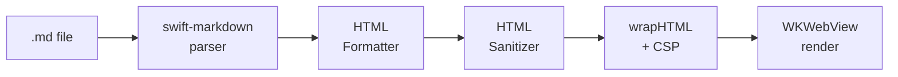

# PeekMark

A premium, native macOS Markdown reader with a system-wide Finder Quick Look preview.

## How It Works



## Quick Start

```bash
# Clone and build
git clone https://github.com/shridhar600/peekmark.git
cd peekmark
xcodegen --project .
xcodebuild -project PeekMark.xcodeproj -scheme PeekMark -configuration Debug build

# Install to /Applications
./script/install.sh
```

To uninstall: `./script/uninstall.sh`.

## Features

### 📖 Reading experience
- **Dual entry points** — Quick Look preview from Finder, or the standalone reader app.
- **Dynamic typography** — font family (System, Serif, Monospace, Rounded), size, and line spacing adjust live.
- **In-document search** — full-text search with highlight and scroll-to-match.

### 🎨 Rendering fidelity
- **GitHub-Flavored Markdown** — tables, task lists, footnotes, strikethrough, autolinks.
- **LaTeX math** — inline `$…$` and display `$$…$$` via KaTeX.
- **Mermaid diagrams** — flowcharts, sequence, Gantt, with light + dark theme matching.
- **Code blocks** — highlight.js, hover overlay with word-wrap toggle and one-click copy.

### ⚡ Finder integration
- **Space-bar preview** — system Quick Look extension launches from any Finder window.
- **Heading anchors** — slugified `id` attributes on every heading for in-doc navigation.
- **Recent files** — sidebar with security-scoped bookmarks, persistent across launches.

### 🔒 Privacy by default
- **Sandboxed** — Apple App Sandbox, minimal entitlements, security-scoped bookmarks.
- **Fully vendored renderer** — Highlight.js, KaTeX, Mermaid bundled in `WebAssets/`. No CDN.
- **No tracking** — no analytics, no telemetry, no crash reporting.

## Limitations

See [LIMITATIONS.md](LIMITATIONS.md) for the full list of what's intentionally not supported in this release.

## Trust & Privacy

- 🔒 **Sandboxed, minimal entitlements.** Strict Content-Security-Policy in the renderer. → [SECURITY.md](SECURITY.md)
- 📦 **Fully vendored renderer.** No CDN, no remote scripts, styles, or fonts. → [SECURITY.md](SECURITY.md)
- 👁️ **No tracking.** No analytics, no telemetry, no crash reports. → [SECURITY.md](SECURITY.md)

Full security model, including the unavoidable WKWebView `network.client` entitlement, the `HTMLSanitizer` rules, and the local-image policy, lives in [SECURITY.md](SECURITY.md).

## Acknowledgements

| Library | License | Purpose |
|---------|---------|---------|
| [swift-markdown](https://github.com/swiftlang/swift-markdown) (Apple) | Apache 2.0 | Markdown parsing and AST |
| [KaTeX](https://katex.org) (Khan Academy) | MIT | LaTeX math rendering |
| [Mermaid.js](https://mermaid.js.org) | MIT | Diagram and chart rendering |
| [Highlight.js](https://highlightjs.org) | BSD 3-Clause | Code syntax highlighting |

See [`THIRD_PARTY_NOTICES.txt`](THIRD_PARTY_NOTICES.txt) for full license texts.

## License

[MIT](LICENSE).
