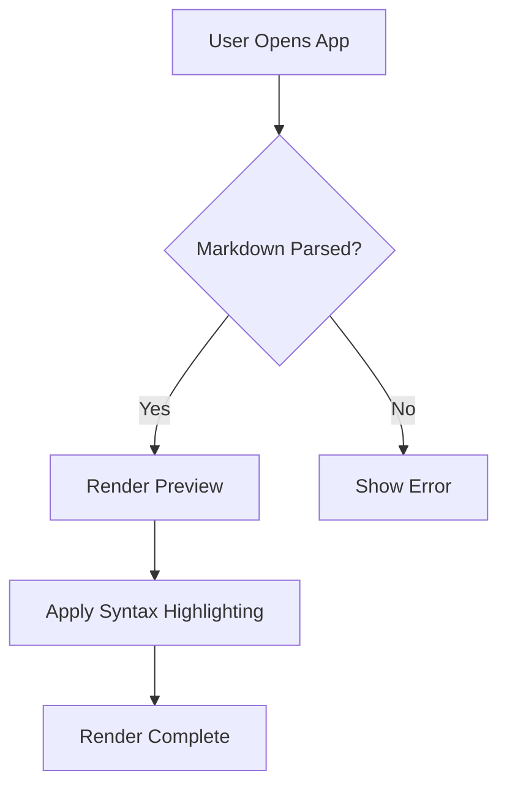
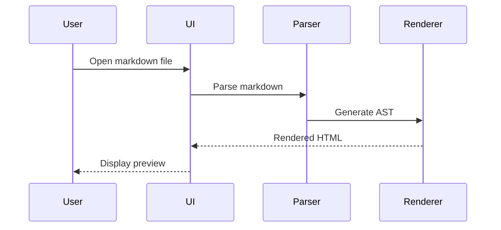
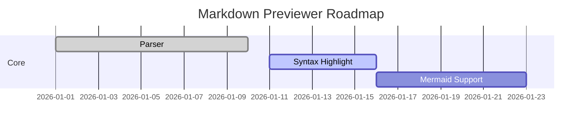
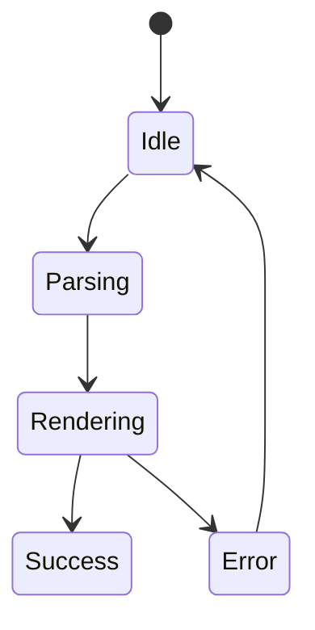
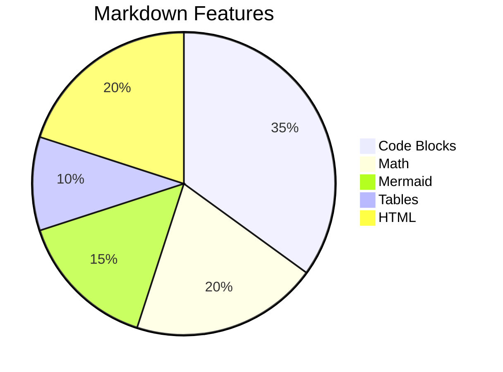

# 📑 Welcome to PeekMark

---

# Typography

## Headings

# H1 Heading
## H2 Heading
### H3 Heading
#### H4 Heading
##### H5 Heading
###### H6 Heading

## Inline Formatting

**Bold text**

*Italic text*

***Bold + Italic***

~~Strikethrough~~

`inline code`

<u>Underline using HTML</u>

==Highlighted text==

> Blockquote with **markdown** inside.

> Nested quote
>> Double nested quote

## Keyboard Shortcuts

Press <kbd>CMD</kbd> + <kbd>K</kbd> to open search.

---

# Lists

## Unordered List

- Apple
- Banana
  - Nested Banana 1
  - Nested Banana 2
    - Deep nesting
- Orange

## Ordered List

1. Step one
2. Step two
3. Step three
   1. Nested ordered item
   2. Another nested item

## Task Lists

- [x] Markdown parsing
- [x] Syntax highlighting
- [ ] PDF export
- [ ] Table virtualization
- [ ] GPU accelerated rendering

---

# Tables

## Standard Table

| Feature | Supported | Notes |
|---|---|---|
| Tables | ✅ | Alignment works |
| Mermaid | ✅ | Needs JS parser |
| LaTeX | ⚠️ | KaTeX required |
| HTML | ✅ | Depends on sanitization |
| Video Embeds | ⚠️ | CSP may block |

## Alignment Test

| Left | Center | Right |
|:---|:---:|---:|
| Apple | Banana | Orange |
| 1 | 2 | 3 |

---

# Code Blocks

## JavaScript

```javascript
async function fetchUser(id) {
  const response = await fetch(`/api/users/${id}`);

  if (!response.ok) {
    throw new Error("Failed to fetch user");
  }

  return await response.json();
}

console.log(await fetchUser(42));
```

## Python

```python
from dataclasses import dataclass
from typing import List

@dataclass
class User:
    id: int
    name: str

users: List[User] = [
    User(1, "Alice"),
    User(2, "Bob")
]

for user in users:
    print(user)
```

## Rust

```rust
fn main() {
    let numbers = vec![1, 2, 3, 4, 5];

    let doubled: Vec<i32> = numbers
        .iter()
        .map(|x| x * 2)
        .collect();

    println!("{:?}", doubled);
}
```

## Swift

```swift
import SwiftUI

struct ContentView: View {
    var body: some View {
        VStack {
            Text("Hello macOS")
                .font(.largeTitle)
                .padding()
        }
    }
}
```

## SQL

```sql
SELECT
    users.id,
    users.name,
    COUNT(posts.id) AS post_count
FROM users
LEFT JOIN posts ON users.id = posts.user_id
GROUP BY users.id, users.name
ORDER BY post_count DESC;
```

## JSON

```json
{
  "name": "markdown-previewer",
  "version": "1.0.0",
  "features": [
    "mermaid",
    "latex",
    "syntax-highlighting"
  ]
}
```

## YAML

```yaml
server:
  host: localhost
  port: 8080

database:
  engine: postgres
  pool_size: 20
```

## Diff

```diff
- const theme = "light";
+ const theme = "dark";

- margin: 8px;
+ margin: 16px;
```

---

# LaTeX

## Inline Math

Einstein said that $E = mc^2$.

## Block Math

$$
\int_{-\infty}^{\infty} e^{-x^2} dx = \sqrt{\pi}
$$

## Matrix

$$
A = \begin{bmatrix}
1 & 2 & 3 \\
4 & 5 & 6 \\
7 & 8 & 9
\end{bmatrix}
$$

## Fourier Transform

$$
F(\omega) = \int_{-\infty}^{\infty} f(t)e^{-i\omega t}dt
$$

## Physics Equation

$$
\nabla \cdot \vec{E} = \frac{\rho}{\epsilon_0}
$$

---

# Mermaid

## Flowchart



## Sequence Diagram



## Gantt Chart



## State Diagram



## Pie Chart



---

# HTML

<div style="padding: 16px; border: 1px solid #888; border-radius: 12px;">
  <h3>Embedded HTML Block</h3>
  <p>This section tests raw HTML rendering.</p>
</div>

## HTML Table

<table>
  <tr>
    <th>Engine</th>
    <th>Status</th>
  </tr>
  <tr>
    <td>WebKit</td>
    <td>✅</td>
  </tr>
  <tr>
    <td>Electron</td>
    <td>✅</td>
  </tr>
</table>

---

# Callouts

> [!NOTE]
> This is a note callout.

> [!TIP]
> This is a tip callout.

> [!WARNING]
> This is a warning callout.

> [!IMPORTANT]
> This is an important callout.

> [!CAUTION]
> Renderer performance may degrade with huge markdown files.

---

# Media

## Images

The first public release of PeekMark intentionally does not render images.

- **Remote images** (e.g. ``) are stripped from
  the preview for privacy — opening a Markdown file must not cause PeekMark
  to contact a third-party host.
- **Local relative images** (e.g. `` next to the Markdown
  file) are also not rendered. PeekMark runs inside the macOS App Sandbox
  and only has read access to the file the user explicitly opened, so it
  cannot read sibling image files in the same directory. The corresponding
  `` tag is stripped from the preview to avoid a broken-image icon.
- **Inline raster data URIs** are self-contained and are preserved by the
  renderer. This is the supported way to embed an image in Markdown intended
  for PeekMark. The 16×16 blue image below is a real, renderable example:

  

See the README "Limitations" section for details.

---

# Advanced Layout

## Collapsible Details

<details>
<summary>Click to expand</summary>

This content is hidden by default.

```bash
npm install markdown-preview-pro
```

</details>

## Nested Details

<details>
<summary>Outer section</summary>

Some content.

<details>
<summary>Inner section</summary>

Deeply nested collapsible content.

</details>

</details>

---

# Wide Content

## Very Wide Table

| Col1 | Col2 | Col3 | Col4 | Col5 | Col6 | Col7 | Col8 | Col9 | Col10 |
|---|---|---|---|---|---|---|---|---|---|
| Data | Data | Data | Data | Data | Data | Data | Data | Data | Data |
| Data | Data | Data | Data | Data | Data | Data | Data | Data | Data |

## Long Code Line

```javascript
const extremelyLongVariableNameThatShouldForceHorizontalScrollingOrWrappingDependingOnYourRendererConfiguration = "This is a very long line intentionally designed to test overflow handling in markdown preview renderers";
```

---

# Footnotes

Markdown preview engines often support footnotes.[^1]

[^1]: This is a footnote definition.

---

# Edge Cases

## Escaped Characters

\*This should not be italicized\*

\`This should not be inline code\`

## Mixed Markdown + HTML

<div>

### Markdown inside HTML container

- Item 1
- Item 2

</div>

## Emoji Stress Test

😀 🚀 🔥 🎉 🧠 ⚡ 💻 🍎 🌙 🎨 📦

## Unicode Test

こんにちは世界
안녕하세요
Привет мир
مرحبا بالعالم
你好世界

---

# Anchor Links

Jump back to [Typography](#typography).

---

# Horizontal Rules

---

***

___

---

# Final Render Checklist

## Rendering

- [ ] Heading hierarchy
- [ ] Syntax highlighting
- [ ] Inline code styling
- [ ] Table overflow
- [ ] Inline raster data URI preserved
- [ ] HTML sanitization
- [ ] Mermaid rendering
- [ ] LaTeX rendering
- [ ] Footnote support
- [ ] Callout rendering
- [ ] Dark mode compatibility
- [ ] Light mode compatibility
- [ ] Smooth scrolling
- [ ] Link navigation
- [ ] Anchor linking

## Performance

- [ ] Large file rendering
- [ ] Incremental updates
- [ ] Scroll performance
- [ ] Virtualization
- [ ] Memory usage

---

# Bonus: Massive Nested Structure

- Level 1
  - Level 2
    - Level 3
      - Level 4
        - Level 5
          - Level 6
            - Level 7
              - Level 8
                - Level 9
                  - Level 10

---

# The End

If your renderer survived this file without exploding, you're already ahead of half the markdown apps out there.

